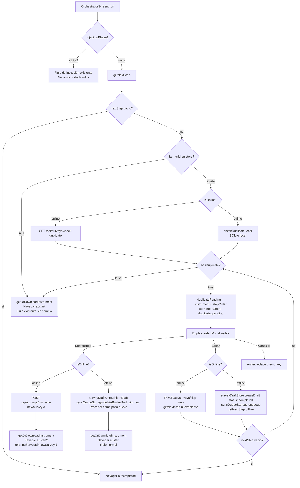

# Spec: Detección y Manejo de Encuestas Duplicadas (Mobile)

## Resumen Ejecutivo

Este spec define cómo agregar detección de encuestas duplicadas al orquestador de campañas en la app mobile (Expo React Native). El flujo replica el comportamiento ya existente en el frontend web, adaptado para funcionar tanto online como offline. Cuando el orquestador detecta que un farmer ya respondió el instrumento del siguiente paso, interrumpe la navegación y muestra un modal con dos opciones: sobrescribir las respuestas anteriores o saltar ese paso. Ambas acciones tienen una variante online (delegada al backend) y una variante offline (operada directamente sobre SQLite mediante Drizzle).

---

## Diagrama de Flujo



---

## 1. Detección de Duplicados (Online vs Offline)

### 1.1 Online

Llamar al endpoint existente del backend:

```
GET /api/surveys/check-duplicate?farmerId=<id>&instrumentId=<id>&campaignId=<id>
Respuesta: { hasDuplicate: boolean, surveyId?: string }
```

### 1.2 Offline: `checkDuplicateLocal`

**Razonamiento sobre el schema actual:**

La tabla `surveys` no tiene `farmerId`. La relación es:
`surveys.campaignSessionId` → la sesión activa en `useCampaignSessionStore` que contiene el `campaignId` de la campaña.

En mobile, una sesión activa pertenece a un solo farmer (el `farmerId` está en el store durante la sesión). Para detectar un duplicado offline es suficiente buscar: ¿existe en SQLite una survey del mismo `instrumentId` vinculada a una sesión de la misma campaña, que tenga al menos una respuesta?

**Query Drizzle necesaria:**

```typescript
// src/storage/duplicateDetection.ts

import { db } from './db/db';
import { surveys, responses, syncQueue } from './db/schema';
import { eq, and, inArray } from 'drizzle-orm';
import { campaignCacheStorage } from './campaignCache';

export interface DuplicateCheckResult {
  hasDuplicate: boolean;
  localSurveyId?: string;
}

/**
 * Busca en SQLite si ya existe una survey completada (con respuestas)
 * para el mismo instrumento dentro de la misma campaña.
 *
 * Estrategia:
 * 1. Obtener todas las campaign_session_ids de la campaña desde campaignCache
 *    (el campo data contiene CampaignRender que tiene campaignId).
 * 2. Buscar surveys con ese instrumentId y alguno de esos campaignSessionIds.
 * 3. Filtrar las que tengan al menos una response.
 */
export async function checkDuplicateLocal(
  instrumentId: string,
  campaignId: string,
): Promise<DuplicateCheckResult> {
  // Paso 1: obtener todos los campaignSessionIds asociados a esta campaña.
  // Los IDs de sesión no se almacenan en campaignCache directamente,
  // pero surveys.campaign_session_id tiene el sessionId.
  // Filtramos surveys por instrumentId y luego verificamos el campaignId
  // a través del store en memoria (campaignId está en useCampaignSessionStore).
  //
  // Simplificación válida en mobile: hay una sola campaña activa a la vez,
  // por lo que buscar por instrumentId en surveys de la sesión activa es suficiente.
  // Si se quiere ser más estricto, cruzar con campaignCache usando la sessionId.

  const matchingSurveys = await db
    .select({ id: surveys.id, campaignSessionId: surveys.campaignSessionId })
    .from(surveys)
    .where(
      and(
        eq(surveys.instrumentId, instrumentId),
        // Excluimos status 'draft' sin respuestas (no son duplicados reales).
        // Incluimos 'completed' y 'synced' (ya enviados).
        // También incluimos 'draft' con respuestas (en progreso = duplicado).
      )
    )
    .all();

  if (matchingSurveys.length === 0) {
    return { hasDuplicate: false };
  }

  // Verificar que la sesión pertenece a la misma campaña.
  // Leer campaignCache para cruzar campaignId.
  const campaign = await campaignCacheStorage.get(campaignId);
  if (!campaign) {
    // Sin caché de campaña no podemos verificar — asumir sin duplicado.
    return { hasDuplicate: false };
  }

  for (const survey of matchingSurveys) {
    // Verificar que tenga al menos una respuesta (no es un marcador vacío de skip).
    const responseCount = await db
      .select({ id: responses.id })
      .from(responses)
      .where(eq(responses.surveyId, survey.id))
      .limit(1)
      .all();

    if (responseCount.length > 0) {
      return { hasDuplicate: true, localSurveyId: survey.id };
    }
  }

  return { hasDuplicate: false };
}
```

**Nota sobre `farmerId`:** ver Sección 4 para la evaluación de si conviene agregar la columna.

### 1.3 Función unificada

```typescript
// src/storage/duplicateDetection.ts (continuación)

import { httpClient } from '../api/httpClient';
import { endpoints } from '../api/endpoints';
import { NetworkError } from '../api/httpClient';

export async function checkDuplicate(params: {
  farmerId: string;
  instrumentId: string;
  campaignId: string;
  isOnline: boolean;
}): Promise<DuplicateCheckResult> {
  const { farmerId, instrumentId, campaignId, isOnline } = params;

  if (isOnline) {
    try {
      const result = await httpClient.get<{ hasDuplicate: boolean; surveyId?: string }>(
        `${endpoints.surveyCheckDuplicate}?farmerId=${farmerId}&instrumentId=${instrumentId}&campaignId=${campaignId}`
      );
      return {
        hasDuplicate: result.hasDuplicate,
        localSurveyId: result.surveyId,
      };
    } catch (err) {
      if (err instanceof NetworkError) {
        // Fallback a detección local si hay error de red.
        return checkDuplicateLocal(instrumentId, campaignId);
      }
      throw err;
    }
  }

  return checkDuplicateLocal(instrumentId, campaignId);
}
```

---

## 2. Manejo de la Acción "Sobrescribir"

### 2.1 Online

```typescript
// src/api/surveys.ts — nuevas funciones a agregar

export interface OverwriteSurveyPayload {
  surveyId: string;
  sessionId: string;
  instrumentId: string;
  stepOrder: number;
}

export interface OverwriteSurveyResponse {
  surveyId: string;
}

export const overwriteSurvey = (payload: OverwriteSurveyPayload) =>
  httpClient.post<OverwriteSurveyResponse>(endpoints.surveyOverwrite, payload);

export interface SkipStepPayload {
  sessionId: string;
  instrumentId: string;
  stepOrder: number;
}

export interface SkipStepResponse {
  surveyId: string;
}

export const skipStep = (payload: SkipStepPayload) =>
  httpClient.post<SkipStepResponse>(endpoints.surveySkipStep, payload);
```

**Flujo online para sobrescribir:**
1. Llamar `POST /api/surveys/overwrite` con `{ surveyId: duplicateSurveyId, sessionId, instrumentId, stepOrder }`.
2. El backend borra la survey anterior y crea una nueva vacía.
3. Recibir `{ surveyId: newSurveyId }`.
4. Navegar a `/instrument/[instrumentId]/start` pasando `existingSurveyId=newSurveyId` como query param.

### 2.2 Offline

```typescript
// En el orquestador — función handleOverwriteOffline

async function handleOverwriteOffline(localSurveyId: string) {
  // 1. Eliminar la entry en syncQueue si existe (evitar enviar datos obsoletos).
  await syncQueueStorage.deleteBySurveyId(localSurveyId);

  // 2. Eliminar el draft local (responses se borran en cascada por FK).
  await surveyDraftStore.deleteDraft(localSurveyId);

  // 3. Proceder como paso normal: navegar a /start sin existingSurveyId.
  //    El InstrumentStartScreen creará un nuevo draft local.
  await getOrDownloadInstrument(nextStep.instrument.instrumentId);
  router.replace(`/instrument/${nextStep.instrument.instrumentId}/start`);
}
```

**Nuevo método requerido en `syncQueueStorage`:**

```typescript
// src/storage/syncQueue.ts — método a agregar

async deleteBySurveyId(surveyId: string): Promise<void> {
  await db.delete(syncQueue).where(eq(syncQueue.surveyId, surveyId));
},
```

---

## 3. Manejo de la Acción "Pasar a la Siguiente Encuesta" (Skip)

### 3.1 Online

```typescript
// En el orquestador — función handleSkipOnline

async function handleSkipOnline() {
  const { sessionId, currentStep } = useCampaignSessionStore.getState();

  await skipStep({
    sessionId: sessionId!,
    instrumentId: nextStep.instrument.instrumentId,
    stepOrder: currentStep!.order,
  });

  // El backend crea survey vacía como marcador. Volver a getNextStep.
  const next = await getNextStep(resolvedSessionId!);
  store.applyNextStep(next);

  if (!next.stepId || !next.instrument) {
    router.replace(`/campaign/${id}/session/${resolvedSessionId}/completed`);
    return;
  }

  // Verificar duplicado del nuevo paso también (llamada recursiva implícita
  // al re-entrar al flujo normal de run()).
  await getOrDownloadInstrument(next.instrument.instrumentId);
  router.replace(`/instrument/${next.instrument.instrumentId}/start`);
}
```

### 3.2 Offline

```typescript
// En el orquestador — función handleSkipOffline

async function handleSkipOffline() {
  const { sessionId, currentStep } = useCampaignSessionStore.getState();
  const skipSurveyId = uuid.v4() as string; // usar expo-crypto o react-native-uuid

  // 1. Crear draft vacío con status 'completed' como marcador de "saltado".
  await surveyDraftStore.createDraft({
    surveyId: skipSurveyId,
    instrumentId: nextStep.instrument.instrumentId,
    campaignSessionId: sessionId ?? undefined,
  });

  // Marcar inmediatamente como completado (sin respuestas = marcador de skip).
  await surveyDraftStore.markCompleted(skipSurveyId);

  // 2. Encolar en syncQueue para que se sincronice cuando haya conexión.
  //    El SyncQueueService detectará que no hay respuestas y lo enviará vacío
  //    (ya maneja este caso: "Nothing to send — survey may have had no answers").
  await syncQueueStorage.enqueue({
    id: uuid.v4() as string,
    surveyId: skipSurveyId,
    campaignSessionId: sessionId ?? undefined,
    stepOrder: currentStep?.order,
  });

  // 3. Simular getNextStep offline: buscar siguiente paso en campaignCache.
  //    Si no se puede determinar offline, navegar a /completed como fallback.
  const nextStepOffline = await getNextStepOffline(resolvedSessionId!);
  if (!nextStepOffline) {
    router.replace(`/campaign/${id}/session/${resolvedSessionId}/completed`);
    return;
  }

  store.applyNextStep(nextStepOffline);
  await getOrDownloadInstrument(nextStepOffline.instrument!.instrumentId);
  router.replace(`/instrument/${nextStepOffline.instrument!.instrumentId}/start`);
}
```

**Nota sobre `getNextStepOffline`:** esta función necesita calcular el siguiente paso sin llamar al backend. La lógica es consultar la campaña en `campaignCache` y determinar qué step sigue según el `stepOrder` actual. Se especifica en Sección 6.

---

## 4. Cambios en el Schema de DB

### Evaluacion: ¿Agregar `farmerId` a la tabla `surveys`?

**Problema actual:** la tabla `surveys` no tiene `farmerId`. Para detección offline de duplicados, la query actual se basa en `instrumentId` + `campaignSessionId`. Dado que en mobile cada sesión de campaña ya está asociada a un farmer específico (el `farmerId` vive en el store), esta aproximación es correcta pero frágil en un escenario donde:
- Múltiples farmers se encuestan en sesiones distintas dentro de la misma campaña en el mismo dispositivo.
- Después de sincronizarse, el dispositivo conserva surveys de farmers anteriores en SQLite.

**Recomendacion: agregar `farmerId` (nullable) a `surveys`.**

Beneficios:
- La detección offline puede filtrar por `farmerId` exacto, evitando falsos positivos entre farmers distintos.
- Alinea el modelo local con el modelo del backend.
- Permite que `purgeSyncedSurveys` sea más selectiva en el futuro.

**Schema actualizado:**

```typescript
// src/storage/db/schema.ts — surveys actualizado

export const surveys = sqliteTable('surveys', {
  id: text('id').primaryKey(),
  campaignSessionId: text('campaign_session_id'),
  instrumentId: text('instrument_id').notNull(),
  farmerId: text('farmer_id'),          // NUEVO — nullable para compatibilidad
  status: text('status', { enum: ['draft', 'completed', 'synced'] })
    .notNull()
    .default('draft'),
  createdAt: integer('created_at', { mode: 'timestamp' }).notNull(),
  updatedAt: integer('updated_at', { mode: 'timestamp' }).notNull(),
});
```

Con `farmerId` disponible, la query offline de `checkDuplicateLocal` mejora:

```typescript
// Versión mejorada con farmerId
const matchingSurveys = await db
  .select({ id: surveys.id })
  .from(surveys)
  .where(
    and(
      eq(surveys.instrumentId, instrumentId),
      eq(surveys.farmerId, farmerId),      // filtro exacto por farmer
    )
  )
  .all();
```

---

## 5. Componente UI: `DuplicateAlertModal`

**Path:** `src/components/campaign/DuplicateAlertModal.tsx`

### Especificacion

```typescript
interface DuplicateAlertModalProps {
  visible: boolean;
  instrumentName: string;
  isLoading: boolean;
  onOverwrite: () => void;
  onSkip: () => void;
  onCancel: () => void;
}
```

### Estructura Visual

```
+------------------------------------------+
|  [overlay semitransparente]              |
|  +--------------------------------------+ |
|  |  Encuesta duplicada                  | |
|  |                                      | |
|  |  Ya existe una encuesta de           | |
|  |  "[instrumentName]" para este        | |
|  |  agricultor.                         | |
|  |                                      | |
|  |  ¿Qué deseas hacer?                  | |
|  |                                      | |
|  |  [ Sobrescribir respuestas    ]  <- rojo / destructivo  |
|  |  [ Pasar a la siguiente       ]  <- verde/primario      |
|  |  [ Cancelar                   ]  <- gris               |
|  +--------------------------------------+ |
+------------------------------------------+
```

### Implementacion Ilustrativa

```typescript
// src/components/campaign/DuplicateAlertModal.tsx

import { Modal, View, Text, Pressable, ActivityIndicator, StyleSheet } from 'react-native';
import { Fonts } from '../../theme/fonts';

export function DuplicateAlertModal({
  visible,
  instrumentName,
  isLoading,
  onOverwrite,
  onSkip,
  onCancel,
}: DuplicateAlertModalProps) {
  return (
    <Modal
      visible={visible}
      transparent
      animationType="fade"
      statusBarTranslucent
    >
      <View style={styles.overlay}>
        <View style={styles.card}>
          <Text style={styles.title}>Encuesta duplicada</Text>
          <Text style={styles.body}>
            Ya existe una encuesta de{' '}
            <Text style={styles.bold}>{instrumentName}</Text>{' '}
            para este agricultor. ¿Qué deseas hacer?
          </Text>

          {isLoading ? (
            <ActivityIndicator size="large" color={GREEN} style={{ marginVertical: 16 }} />
          ) : (
            <>
              <Pressable style={[styles.button, styles.destructive]} onPress={onOverwrite}>
                <Text style={styles.buttonText}>Sobrescribir respuestas</Text>
              </Pressable>

              <Pressable style={[styles.button, styles.primary]} onPress={onSkip}>
                <Text style={styles.buttonText}>Pasar a la siguiente encuesta</Text>
              </Pressable>

              <Pressable style={[styles.button, styles.secondary]} onPress={onCancel}>
                <Text style={[styles.buttonText, styles.secondaryText]}>Cancelar</Text>
              </Pressable>
            </>
          )}
        </View>
      </View>
    </Modal>
  );
}

const GREEN = '#1B6B3A';

const styles = StyleSheet.create({
  overlay: {
    flex: 1,
    backgroundColor: 'rgba(0,0,0,0.5)',
    justifyContent: 'center',
    alignItems: 'center',
    padding: 24,
  },
  card: {
    width: '100%',
    backgroundColor: '#fff',
    borderRadius: 16,
    padding: 24,
    gap: 12,
  },
  title: { fontSize: 18, fontFamily: Fonts.bold, color: '#111827' },
  body: { fontSize: 15, fontFamily: Fonts.regular, color: '#374151', lineHeight: 22 },
  bold: { fontFamily: Fonts.semiBold },
  button: {
    borderRadius: 12,
    paddingVertical: 16,
    alignItems: 'center',
  },
  destructive: { backgroundColor: '#DC2626' },
  primary: { backgroundColor: GREEN },
  secondary: { backgroundColor: '#F3F4F6', borderWidth: 1, borderColor: '#E5E7EB' },
  buttonText: { fontSize: 15, fontFamily: Fonts.semiBold, color: '#fff' },
  secondaryText: { color: '#374151' },
});
```

**Decisión: usar `Modal` nativo de React Native** (no `View` absoluta) para garantizar que el overlay cubra la `SafeAreaView` y la barra de estado. `animationType="fade"` con `statusBarTranslucent` asegura comportamiento correcto en Android.

---

## 6. Modificaciones al Orquestador

**Path:** `app/campaign/[id]/session/[sessionId]/orchestrator.tsx`

### 6.1 Nuevos estados

```typescript
// Ampliar el tipo ScreenState
type ScreenState = 'loading' | 'offline' | 'injection_error' | 'error' | 'duplicate_pending';

// Nuevo estado local
const [duplicatePending, setDuplicatePending] = useState<{
  instrument: { instrumentId: string; name: string };
  stepOrder: number;
  localSurveyId?: string; // presente si viene de detección offline
  remoteSurveyId?: string; // presente si viene de detección online
} | null>(null);

const [modalLoading, setModalLoading] = useState(false);
```

### 6.2 Modificación al flujo normal (`run`)

Reemplazar el bloque del flujo normal (líneas 122-131 del orquestador actual):

```typescript
// ANTES (flujo normal existente):
const nextStep = await getNextStep(resolvedSessionId);
store.applyNextStep(nextStep);
if (!nextStep.stepId || !nextStep.instrument) {
  router.replace(`/campaign/${id}/session/${resolvedSessionId}/completed`);
  return;
}
await getOrDownloadInstrument(nextStep.instrument.instrumentId);
router.replace(`/instrument/${nextStep.instrument.instrumentId}/start`);

// DESPUÉS (flujo normal con detección de duplicados):
const nextStep = await getNextStep(resolvedSessionId);
store.applyNextStep(nextStep);

if (!nextStep.stepId || !nextStep.instrument) {
  router.replace(`/campaign/${id}/session/${resolvedSessionId}/completed`);
  return;
}

// Verificar duplicado solo si hay farmerId (farmer existente, no nuevo en inyección).
const { farmerId, campaign } = useCampaignSessionStore.getState();

if (farmerId && campaign?.campaignId) {
  const duplicateResult = await checkDuplicate({
    farmerId,
    instrumentId: nextStep.instrument.instrumentId,
    campaignId: campaign.campaignId,
    isOnline,
  });

  if (duplicateResult.hasDuplicate) {
    setDuplicatePending({
      instrument: nextStep.instrument,
      stepOrder: nextStep.order ?? 0,
      localSurveyId: duplicateResult.localSurveyId,
      remoteSurveyId: isOnline ? duplicateResult.localSurveyId : undefined,
    });
    setScreenState('duplicate_pending');
    return; // Detener aquí; el modal toma el control.
  }
}

await getOrDownloadInstrument(nextStep.instrument.instrumentId);
router.replace(`/instrument/${nextStep.instrument.instrumentId}/start`);
```

**Mismo bloque a aplicar en el flujo post-S2** (líneas 112-119 del orquestador actual, donde también se llama `getNextStep`).

### 6.3 Cuándo NO verificar duplicados

- `injectionPhase === 's1'` o `'s2'`: farmer aún no identificado. No verificar.
- `farmerId === null`: nuevo farmer en proceso de inyección. No verificar.
- Después de `handleSkip` al llamar `getNextStep` nuevamente: verificar sí (el loop puede encontrar otro duplicado en el siguiente paso).

### 6.4 `handleOverwrite`

```typescript
const handleOverwrite = useCallback(async () => {
  if (!duplicatePending || !resolvedSessionId) return;
  setModalLoading(true);

  try {
    if (isOnline) {
      const { sessionId, currentStep } = useCampaignSessionStore.getState();
      const { surveyId: newSurveyId } = await overwriteSurvey({
        surveyId: duplicatePending.remoteSurveyId!,
        sessionId: sessionId!,
        instrumentId: duplicatePending.instrument.instrumentId,
        stepOrder: duplicatePending.stepOrder,
      });

      await getOrDownloadInstrument(duplicatePending.instrument.instrumentId);
      setDuplicatePending(null);
      setScreenState('loading');
      // Pasar existingSurveyId como query param para que /start use ese ID.
      router.replace(
        `/instrument/${duplicatePending.instrument.instrumentId}/start?existingSurveyId=${newSurveyId}`
      );
    } else {
      // Offline: borrar draft anterior y proceder como paso nuevo.
      if (duplicatePending.localSurveyId) {
        await syncQueueStorage.deleteBySurveyId(duplicatePending.localSurveyId);
        await surveyDraftStore.deleteDraft(duplicatePending.localSurveyId);
      }
      await getOrDownloadInstrument(duplicatePending.instrument.instrumentId);
      setDuplicatePending(null);
      setScreenState('loading');
      router.replace(`/instrument/${duplicatePending.instrument.instrumentId}/start`);
    }
  } catch (err) {
    setModalLoading(false);
    setScreenState('error');
    setErrorMessage(err instanceof Error ? err.message : 'Error al sobrescribir');
  }
}, [duplicatePending, resolvedSessionId, isOnline]);
```

### 6.5 `handleSkip`

```typescript
const handleSkip = useCallback(async () => {
  if (!duplicatePending || !resolvedSessionId) return;
  setModalLoading(true);

  try {
    const { sessionId } = useCampaignSessionStore.getState();

    if (isOnline) {
      await skipStepApi({
        sessionId: sessionId!,
        instrumentId: duplicatePending.instrument.instrumentId,
        stepOrder: duplicatePending.stepOrder,
      });
    } else {
      // Crear marcador offline de "saltado".
      const skipSurveyId = Crypto.randomUUID();
      await surveyDraftStore.createDraft({
        surveyId: skipSurveyId,
        instrumentId: duplicatePending.instrument.instrumentId,
        campaignSessionId: sessionId ?? undefined,
      });
      await surveyDraftStore.markCompleted(skipSurveyId);
      await syncQueueStorage.enqueue({
        id: Crypto.randomUUID(),
        surveyId: skipSurveyId,
        campaignSessionId: sessionId ?? undefined,
        stepOrder: duplicatePending.stepOrder,
      });
    }

    setDuplicatePending(null);
    setModalLoading(false);
    // Re-ejecutar run() para obtener el siguiente paso.
    hasStarted.current = false;
    run();
  } catch (err) {
    setModalLoading(false);
    setScreenState('error');
    setErrorMessage(err instanceof Error ? err.message : 'Error al saltar paso');
  }
}, [duplicatePending, resolvedSessionId, isOnline, run]);
```

### 6.6 Cancelar

```typescript
const handleCancel = useCallback(() => {
  setDuplicatePending(null);
  router.replace(`/campaign/${id}/pre-survey`);
}, [id, router]);
```

### 6.7 Render del modal en el orquestador

Agregar al return principal (antes del return de loading):

```typescript
// Siempre renderizar el modal (visible=false cuando no es necesario)
// para evitar desmontajes abruptos durante animaciones.
<DuplicateAlertModal
  visible={screenState === 'duplicate_pending'}
  instrumentName={duplicatePending?.instrument.name ?? ''}
  isLoading={modalLoading}
  onOverwrite={handleOverwrite}
  onSkip={handleSkip}
  onCancel={handleCancel}
/>
```

### 6.8 `getNextStepOffline` para skip offline

Cuando se hace skip offline, no se puede llamar al backend para obtener el siguiente paso. La función debe consultar la campaña cacheada:

```typescript
// src/lib/getNextStepOffline.ts

import { campaignCacheStorage } from '../storage/campaignCache';
import { db } from '../storage/db/db';
import { surveys } from '../storage/db/schema';
import { eq, and } from 'drizzle-orm';
import type { NextStepResponse } from '../types';

/**
 * Calcula el siguiente paso de la campaña de forma local,
 * sin llamar al backend. Usado en modo offline después de un skip.
 */
export async function getNextStepOffline(
  campaignId: string,
  sessionId: string,
  currentStepOrder: number,
): Promise<NextStepResponse | null> {
  const campaign = await campaignCacheStorage.get(campaignId);
  if (!campaign) return null;

  // Ordenar pasos por order.
  const sortedSteps = [...campaign.steps].sort((a, b) => a.order - b.order);

  // Determinar qué pasos ya están completados en SQLite.
  const completedSurveys = await db
    .select({ instrumentId: surveys.instrumentId })
    .from(surveys)
    .where(
      and(
        eq(surveys.campaignSessionId, sessionId),
        // 'completed' o 'synced' = paso terminado o marcado como skip.
      )
    )
    .all();

  const completedInstrumentIds = new Set(completedSurveys.map((s) => s.instrumentId));

  // Encontrar el primer paso incompleto después del paso actual.
  const nextStep = sortedSteps.find(
    (step) =>
      step.order > currentStepOrder &&
      !completedInstrumentIds.has(step.instrument.instrumentId)
  );

  if (!nextStep) {
    return { nextStep: null }; // Campaña completada.
  }

  return {
    stepId: nextStep.stepId,
    order: nextStep.order,
    instrument: nextStep.instrument,
    totalSteps: sortedSteps.length,
    completedCount: completedInstrumentIds.size,
  };
}
```

---

## 7. Nuevos Archivos y Archivos a Modificar

### Archivos Nuevos

| Path | Responsabilidad |
|------|----------------|
| `src/storage/duplicateDetection.ts` | Funciones `checkDuplicateLocal` y `checkDuplicate` (unificada online/offline) |
| `src/components/campaign/DuplicateAlertModal.tsx` | Componente UI del modal de duplicado |
| `src/lib/getNextStepOffline.ts` | Calcula siguiente paso sin backend (para skip offline) |

### Archivos a Modificar

| Path | Cambios |
|------|---------|
| `src/storage/db/schema.ts` | Agregar columna `farmerId` (nullable) a tabla `surveys` |
| `src/storage/db/migrations/index.ts` | Agregar migración `m0001` con `ALTER TABLE surveys ADD COLUMN farmer_id text` |
| `src/storage/syncQueue.ts` | Agregar método `deleteBySurveyId(surveyId: string): Promise<void>` |
| `src/api/surveys.ts` | Agregar funciones `overwriteSurvey` y `skipStep` con sus tipos |
| `src/api/endpoints.ts` | Agregar `surveyCheckDuplicate`, `surveyOverwrite`, `surveySkipStep` |
| `src/storage/surveyDraftStore.ts` | Actualizar `createDraft` para aceptar y persistir `farmerId` opcional |
| `app/campaign/[id]/session/[sessionId]/orchestrator.tsx` | Integrar detección de duplicados, nuevos estados, funciones `handleOverwrite`/`handleSkip`/`handleCancel`, render del modal |
| `app/instrument/[id]/start.tsx` | Leer query param `existingSurveyId` para usar en `createDraft` en lugar de crear uno nuevo. Si presente, saltar la llamada a `createSurvey` (el backend ya creó la survey). |

### Cambio en `InstrumentStartScreen` para `existingSurveyId`

```typescript
// app/instrument/[id]/start.tsx — handleStart actualizado

const { existingSurveyId } = useLocalSearchParams<{
  id: string;
  existingSurveyId?: string;
}>();

const handleStart = async () => {
  // ...
  let surveyId: string;

  if (existingSurveyId) {
    // El backend ya creó la survey vacía en /overwrite.
    // Solo crear el draft local con ese ID.
    surveyId = existingSurveyId;
    await surveyDraftStore.createDraft({
      surveyId,
      instrumentId: instrument.instrumentId,
      campaignSessionId: campaignSessionId ?? undefined,
      farmerId: farmerId ?? undefined,
    });
  } else {
    // Flujo normal: crear survey en backend + draft local.
    const response = await createSurvey(surveyPayload);
    surveyId = response.surveyId;
    await surveyDraftStore.createDraft({
      surveyId,
      instrumentId: instrument.instrumentId,
      campaignSessionId: campaignSessionId ?? undefined,
      farmerId: farmerId ?? undefined,
    });
  }

  initializeSurvey({ surveyId, ... });
  router.push(`/instrument/${id}/question/0`);
};
```

---

## 8. Migración de Base de Datos

### Migración `m0001`

```typescript
// src/storage/db/migrations/index.ts — actualizado

const migrations = {
  journal: {
    entries: [
      { idx: 0, when: 0, tag: 'm0000', breakpoints: true },
      { idx: 1, when: 1, tag: 'm0001', breakpoints: true },  // NUEVO
    ],
  },
  migrations: {
    m0000: [
      // ... SQL existente sin cambios ...
    ].join('\n'),

    m0001: [
      // SQLite soporta ADD COLUMN directamente.
      // La columna es nullable para compatibilidad con registros existentes.
      "ALTER TABLE `surveys` ADD COLUMN `farmer_id` text",
    ].join('\n'),
  },
};
```

**Compatibilidad:** SQLite permite `ALTER TABLE ... ADD COLUMN` solo si la columna es nullable o tiene un DEFAULT. `farmer_id text` (nullable) cumple esta condición. No se necesita recrear la tabla.

**Impacto en registros existentes:** todos los surveys ya existentes en dispositivos tendrán `farmer_id = NULL`. La detección offline caerá al modo sin filtro por farmer para esos registros, lo cual es aceptable dado que son datos históricos del dispositivo.

---

## Riesgos y Consideraciones

### Riesgo 1: Skip offline con `getNextStepOffline` impreciso

`getNextStepOffline` no conoce las condiciones condicionales de los pasos (`conditionQuestion`, `conditionValue`). Si una campaña tiene pasos condicionales (actualmente `CampaignStepRender` tiene estos campos), el cálculo offline puede mostrar pasos que el backend omitiría. **Mitigacion:** en MVP, si hay pasos condicionales en la campaña activa, deshabilitar el skip offline y mostrar un mensaje de "necesitas conexión para saltar este paso".

### Riesgo 2: Race condition en `SyncQueueService` durante `deleteBySurveyId`

Si el `SyncQueueService` está procesando una entry `in_flight` del survey duplicado justo cuando el usuario decide sobrescribir, `deleteBySurveyId` podría intentar borrar una row que ya está marcada `in_flight`. **Mitigacion:** el método `deleteBySurveyId` borra sin condición de status; si la sincronización completa antes del borrado, la row ya fue eliminada por `markSynced`. Si borramos mientras está `in_flight`, el `SyncQueueService` fallará al intentar actualizar la row y entrará al handler de error. Este caso es extremadamente raro en mobile (la detección ocurre antes de iniciar la encuesta, no mientras una sincronización está en vuelo para el mismo survey).

### Riesgo 3: `existingSurveyId` en query params expuesto en navegación

Pasar el `surveyId` por URL query param es visible en logs de expo-router. No representa riesgo de seguridad crítico (el ID no es secreto y la pantalla lo usaría de todas formas), pero conviene documentarlo. Alternativa: pasar el ID a través del store Zustand en vez de URL, pero complica el ciclo de vida.

### Riesgo 4: Detección online sin farmerId al inicio de sesión

`checkDuplicate` requiere `farmerId`. Si el store tiene `farmerId` stale de una sesión anterior (el `reset()` debería limpiarlo), podría producir un falso positivo. **Mitigacion:** verificar que `useCampaignSessionStore.reset()` se llame correctamente al iniciar una nueva sesión en `PreSurveyScreen`.

### Riesgo 5: Modal visible durante reintento de conexión

El `useEffect` de auto-retry cuando `isOnline` cambia a `true` llama `run()`. Si el modal está visible (`screenState === 'duplicate_pending'`) y el dispositivo reconecta, el auto-retry no debe ocurrir. **Mitigacion:** en el `useEffect` de auto-retry, agregar condición `&& screenState !== 'duplicate_pending'`.

---

## Orden de Implementacion Sugerido

### Fase 1 — Infraestructura (sin UI)

1. **Schema + migración:** agregar `farmerId` a `surveys` y crear migración `m0001`. Verificar que el migrador de Drizzle aplique correctamente sobre instalaciones existentes.
2. **`syncQueue.ts`:** agregar `deleteBySurveyId`.
3. **`surveyDraftStore.ts`:** actualizar `createDraft` para aceptar `farmerId`.
4. **`endpoints.ts`:** agregar las tres nuevas rutas de surveys.
5. **`surveys.ts` (API):** agregar `overwriteSurvey` y `skipStep`.

### Fase 2 — Logica de deteccion

6. **`src/storage/duplicateDetection.ts`:** implementar `checkDuplicateLocal` y `checkDuplicate`.
7. **`src/lib/getNextStepOffline.ts`:** implementar calculo offline del siguiente paso.
8. Escribir tests unitarios para `checkDuplicateLocal` cubriendo: sin duplicados, duplicado con respuestas, survey vacía (no es duplicado), múltiples surveys.

### Fase 3 — UI y orquestador

9. **`DuplicateAlertModal.tsx`:** implementar componente.
10. **`orchestrator.tsx`:** integrar detección, estados, handlers y render del modal.
11. **`app/instrument/[id]/start.tsx`:** agregar soporte para `existingSurveyId` en query params.

### Fase 4 — QA

12. Prueba manual online: verificar flujo completo sobrescribir y saltar.
13. Prueba manual offline: desactivar red, ejecutar flujo, verificar que el marcador se crea en SQLite y se sincroniza al reconectar.
14. Prueba de regresión: flujo de inyección S1/S2 no debe activar el modal de duplicados.
